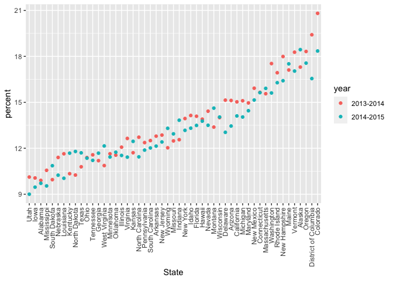
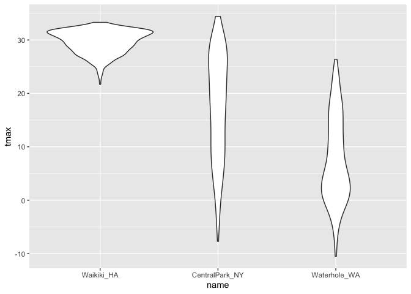

Reading Data
================

String vs. Factors both look like character vectors, but - strings are
just strings - factors have an underlying numeric structure with
character labels sitting on top factors generally make sense for
variables that take on a few meaningful values

string there are lots things can do with strings - concatenating:
joining snippets into a long - shortening, subsetting, or turncating -
changing cases - replacing one string segment with another

factor controlling factors is critical in several situations - defining
reference group in models - ordering variables - introducing new factor
levels common ooperation - convert character variables to factors -
releveling by hand/count/a second variable - renaming levels - dropping
unused levels the forcats package is the way to go for the majority of
your factor
    needs

``` r
library(tidyverse)
```

    ## ── Attaching packages ─────────────────────────────────────── tidyverse 1.3.0 ──

    ## ✓ ggplot2 3.3.2     ✓ purrr   0.3.4
    ## ✓ tibble  3.0.3     ✓ dplyr   1.0.2
    ## ✓ tidyr   1.1.2     ✓ stringr 1.4.0
    ## ✓ readr   1.3.1     ✓ forcats 0.5.0

    ## ── Conflicts ────────────────────────────────────────── tidyverse_conflicts() ──
    ## x dplyr::filter() masks stats::filter()
    ## x dplyr::lag()    masks stats::lag()

``` r
library(rvest)
```

    ## Loading required package: xml2

    ## 
    ## Attaching package: 'rvest'

    ## The following object is masked from 'package:purrr':
    ## 
    ##     pluck

    ## The following object is masked from 'package:readr':
    ## 
    ##     guess_encoding

## Strings and regex

``` r
string_vec = c("my", "name", "is", "jeff")

str_detect(string_vec, "jeff")
```

    ## [1] FALSE FALSE FALSE  TRUE

``` r
str_detect(string_vec, "e") #does not have to match the pattern exactly
```

    ## [1] FALSE  TRUE FALSE  TRUE

``` r
str_detect(string_vec, "Jeff") #uppercase and lowercase are different 
```

    ## [1] FALSE FALSE FALSE FALSE

``` r
str_replace(string_vec,"jeff", "Jeff")
```

    ## [1] "my"   "name" "is"   "Jeff"

``` r
string_vec = c(
  "i think we all rule for participating",
  "i think i have been caught",
  "i think this will be quite fun actually",
  "it will be fun, i think"
  )

str_detect(string_vec, "i think")
```

    ## [1] TRUE TRUE TRUE TRUE

``` r
# can I detect strings that start with "i think"?
str_detect(string_vec, "^i think")
```

    ## [1]  TRUE  TRUE  TRUE FALSE

``` r
# ends with
str_detect(string_vec, "i think$")
```

    ## [1] FALSE FALSE FALSE  TRUE

``` r
string_vec = c(
  "Y'all remember Pres. HW Bush?",
  "I saw a green bush",
  "BBQ and Bushwalking at Molonglo Gorge",
  "BUSH -- LIVE IN CONCERT!!"
  )

str_detect(string_vec, "bush")
```

    ## [1] FALSE  TRUE FALSE FALSE

``` r
str_detect(string_vec, "Bush")
```

    ## [1]  TRUE FALSE  TRUE FALSE

``` r
# both "bush" and "Bush"
str_detect(string_vec, "[Bb]ush")
```

    ## [1]  TRUE  TRUE  TRUE FALSE

``` r
string_vec = c(
  '7th inning stretch',
  '1st half soon to begin. Texas won the toss.',
  'she is 5 feet 4 inches tall',
  '3AM - cant sleep :('
  )

#number first followed immediately by a letter 
str_detect(string_vec, "[0-9][a-zA-Z]")
```

    ## [1]  TRUE  TRUE FALSE  TRUE

``` r
str_detect(string_vec, "^[0-9][a-zA-Z]")
```

    ## [1]  TRUE  TRUE FALSE  TRUE

``` r
string_vec = c(
  'Its 7:11 in the evening',
  'want to go to 7-11?',
  'my flight is AA711',
  'NetBios: scanning ip 203.167.114.66'
  )

str_detect(string_vec, "7.11")
```

    ## [1]  TRUE  TRUE FALSE  TRUE

``` r
#. -> special character matches anything
# to detect an actual dot:
str_detect(string_vec, "7\\.11")
```

    ## [1] FALSE FALSE FALSE  TRUE

``` r
string_vec = c(
  'The CI is [2, 5]',
  ':-]',
  ':-[',
  'I found the answer on pages [6-7]'
  )

str_detect(string_vec, "\\[")
```

    ## [1]  TRUE FALSE  TRUE  TRUE

\#\#factors

``` r
factor_vec = factor(c("male","male","female", "female"))
# factors give levels (alphabet order)
# strings are in quotes

as.numeric(factor_vec)
```

    ## [1] 2 2 1 1

relevel

``` r
factor_vec = fct_relevel(factor_vec, "male")
# factor relevel: (a factor or character ) relevel by hand

as.numeric(factor_vec)
```

    ## [1] 1 1 2 2

## NSDUH - strings

``` r
url = "http://samhda.s3-us-gov-west-1.amazonaws.com/s3fs-public/field-uploads/2k15StateFiles/NSDUHsaeShortTermCHG2015.htm"

drug_use_html = read_html(url)

tabl_marj = 
  drug_use_html %>% 
  html_nodes(css = "table") %>% 
  first() %>%
  html_table() %>% #view()
  slice(-1) %>% #remove first row
  as_tibble()
```

``` r
data_marj =
  tabl_marj %>% 
  select(-contains("P Value")) %>% 
  pivot_longer(
    -State, #eveything not in the state
    names_to = "age_year",
    values_to = "percent"
  ) %>% 
  separate(age_year, into = c("age","year"), sep = "\\(") %>% 
  mutate(
    year = str_replace(year, "\\)", ""), #replace ) with empty
    percent = str_replace(percent, "[a-c]$", ""),
    percent = as.numeric(percent)
  ) %>% 
  filter(!(State %in% c("Total U.S.", "Northeast", "Midwest", "South", "West")))
```

## NSDUH - factor

``` r
data_marj %>% 
  filter(age == "12-17") %>% 
  #mutate(State = fct_relevel(State, "Texas", "Oklahoma")) %>%
  mutate(State = fct_reorder(State, percent)) %>%  # the lowest percent will be the first; multiple percent observations per state will be calculated mean with the fct 
  ggplot(aes(State, y = percent, color = year)) +
  geom_point() +
  theme(axis.text.x = element_text(angle = 90, vjust = 0.5, hjust = 1))
```

<!-- -->

## Weather dataset

``` r
weather_df = 
  rnoaa::meteo_pull_monitors(
    c("USW00094728", "USC00519397", "USS0023B17S"),
    var = c("PRCP", "TMIN", "TMAX"), 
    date_min = "2017-01-01",
    date_max = "2017-12-31") %>%
  mutate(
    name = recode(
      id, 
      USW00094728 = "CentralPark_NY", 
      USC00519397 = "Waikiki_HA",
      USS0023B17S = "Waterhole_WA"),
    tmin = tmin / 10,
    tmax = tmax / 10) %>%
  select(name, id, everything())
```

    ## Registered S3 method overwritten by 'hoardr':
    ##   method           from
    ##   print.cache_info httr

    ## using cached file: /Users/deidei/Library/Caches/R/noaa_ghcnd/USW00094728.dly

    ## date created (size, mb): 2020-10-04 19:30:14 (7.522)

    ## file min/max dates: 1869-01-01 / 2020-10-31

    ## using cached file: /Users/deidei/Library/Caches/R/noaa_ghcnd/USC00519397.dly

    ## date created (size, mb): 2020-10-04 19:32:02 (1.699)

    ## file min/max dates: 1965-01-01 / 2020-03-31

    ## using cached file: /Users/deidei/Library/Caches/R/noaa_ghcnd/USS0023B17S.dly

    ## date created (size, mb): 2020-10-04 19:32:19 (0.88)

    ## file min/max dates: 1999-09-01 / 2020-10-31

``` r
weather_df %>% 
  mutate(name = fct_relevel(name, "Waikiki_HA")) %>% 
  #mutate(name = fct_order(name, tmax))
  ggplot(aes(x = name, y = tmax)) +
  geom_violin()
```

    ## Warning: Removed 3 rows containing non-finite values (stat_ydensity).

<!-- -->

``` r
weather_df %>% 
  lm(tmax ~ name, data= .)
```

    ## 
    ## Call:
    ## lm(formula = tmax ~ name, data = .)
    ## 
    ## Coefficients:
    ##      (Intercept)    nameWaikiki_HA  nameWaterhole_WA  
    ##           17.366            12.291            -9.884
